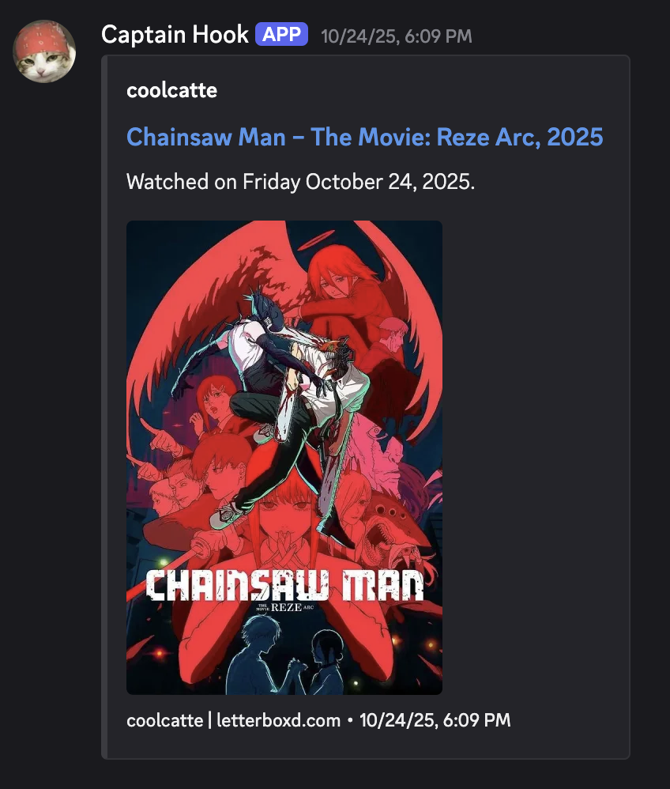

# Discord Letterboxd Hook



Share your Letterboxd watchlog with your Discord server friends!

 This repo holds one Node.js script (`app/handler.js`) plus Pulumi projects and a cron-friendly helper to deploy to the target platform of your choice.

## Requirements
- Node.js 22+
- pnpm 10+
- A target where the script can run on a schedule: VPS/cron, AWS Lambda, Azure Functions, or Google Cloud Functions

## How It Works
- Polls each listed Letterboxd diary RSS feed and treats only real film entries (`letterboxd.com/film/...`, ratings, or “Watched on …”) as diary posts.
- Sends a Discord embed per entry with poster art, watched date, rating, and optional label like `letterboxduser (@DiscordName)`.
- Remembers the last diary entry it handled so only new entries are posted. If the checkpoint ever goes missing, the script backfills again.
- Accept as many usernames as you want by separating them with commas (`user1,user2`). Add `:text` after any name (`user1:FilmFan`) if you want to share your Discord username alongside your Letterboxd username.

## Quick Start
1. `cd app && pnpm install`
2. Set `DISCORD_WEBHOOK_URL` and `USERNAME` in your shell or `.env`
3. Run the [manual test](#manual-test) to post the newest entry once
4. Pick a deployment path and use those same env vars

## Choose a Deployment
Every option lives under `infra/`. The cloud providers each have their own Pulumi project. Additionally, there is a helper script for a plain Linux host under `infra/vps/`.

| Target | Features | State store |
| --- | --- | --- |
| Linux VPS / cron | Simple `node` run plus a sample cron line for logging. | Local file (`STATE_FILE`). |
| AWS Lambda (Pulumi) | EventBridge Scheduler triggers the handler with AWS-native auth. | AWS SSM Parameter Store. |
| Azure Functions (Pulumi) | Timer triggered Function App on the consumption plan. | Azure Blob Storage. |
| Google Cloud Functions (Pulumi) | Cloud Scheduler → Cloud Functions v2 with OIDC auth. | Google Cloud Storage. |

> Run `pnpm install --prod` inside `app/` before packaging for any cloud target so your archive includes the current dependencies.

## State Storage
The handler auto-detects where to save the “last seen diary entry” marker:
- AWS: Lambda defaults to **AWS SSM Parameter Store**.
- VPS: Set `STATE_FILE` (used by the VPS helper) to keep the marker on disk.
- Azure: Add `AZURE_STORAGE_CONNECTION_STRING` to use **Azure Blob Storage**.
- GGP: Provide `GCP_STATE_BUCKET` (or `STATE_BACKEND=gcp-storage`) to keep state in **Google Cloud Storage**.

If you wish to override the auto-detection, set `STATE_BACKEND` to `aws-ssm`, `file`, `azure-blob`, or `gcp-storage`.

Each username gets its own checkpoint automatically. Add `{user}` to `PARAM_NAME`, `AZURE_STATE_BLOB`, or `GCP_STATE_OBJECT` if you want to control how those per-user names look.

## Environment Variables
These apply to every deployment. Pulumi stacks map them to cloud config values, while the VPS helper consumes them directly.

**Required**

| Variable | Purpose |
| --- | --- |
| `DISCORD_WEBHOOK_URL` | Webhook that receives embed posts. For further information, see Discord's documentation regarding [Intro to Webhooks](https://support.discord.com/hc/en-us/articles/228383668-Intro-to-Webhooks) and [Webhook Resource](https://discord.com/developers/docs/resources/webhook#webhook-object). |
| `USERNAME` | Comma-separated Letterboxd usernames (`name1,name2`). Append `:<text>` to show a label in Discord (`name1:FilmFan`). Deprecated aliases: `LETTERBOXD_USERNAME`, `LETTERBOXD_USERNAMES`. |

**Optional**

| Variable | Purpose |
| --- | --- |
| `PARAM_NAME` | Custom SSM parameter name (default `/letterboxd/lastSeenId`). |
| `STATE_FILE` | Local file path for VPS runs (default `app/.lastSeen`). |
| `STATE_BACKEND` | Force the state provider (`aws-ssm`, `file`, `azure-blob`, `gcp-storage`). |
| `AZURE_STORAGE_CONNECTION_STRING`, `AZURE_STATE_CONTAINER`, `AZURE_STATE_BLOB` | Point at the Azure storage account and customize the container/blob names. |
| `GCP_STATE_BUCKET`, `GCP_STATE_OBJECT` | Choose the Cloud Storage bucket/object used for state. |
| `MAX_POSTS` | Limit how many diary entries ship per invocation. |
| `LOG_LEVEL` | `debug`, `info` (default), `warn`, or `error`. |
| `DRY_RUN` | `true` logs the payload instead of posting. |
| `FORCE_MOST_RECENT` | `true` re-posts the newest entry even when nothing changed (good for manual tests). |
| `SCHEDULE_FORCE_MOST_RECENT` | Same as above but automatically applied to scheduled runs. |
| `PERSIST_FORCED_STATE` | `true` (default) writes forced posts back to state. Set `false` when you want to replay the newest entry for troubleshooting. |
| `LAST_SEEN_OVERRIDE` | Temporarily pretend the stored ID is something else for ad-hoc replays. |

`SCHEDULE_FORCE_MOST_RECENT` plus `PERSIST_FORCED_STATE=false` keeps reposting the same entry until real diary activity arrives, so only use that combo when you are actively debugging.

## Manual Test
```bash
cd app
pnpm install
node -e 'require("./handler").handler({ forceMostRecent: true, maxPosts: 1 }).then(console.log).catch(console.error)'
```
